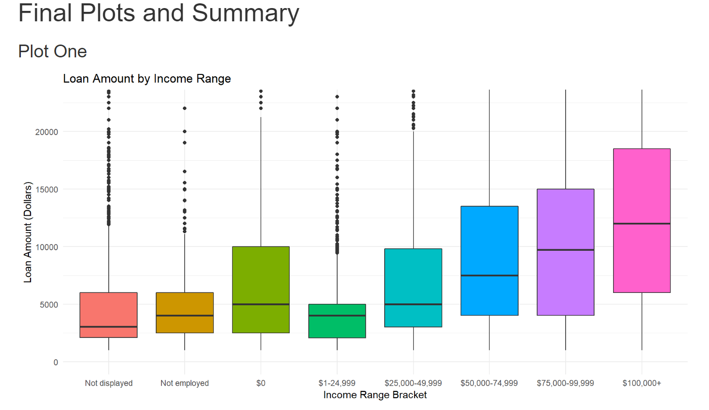

# Exploratory Data Analysis Project On Loan Data Using R.

I recently completed Udacity's Data Analyst Nanodegree, and this exploratory data analysis project was completed in the first part of the course. 

This project involved investigating loan data from Prosper, a marketplace lending platform, and was carried out using R software. The data set consists of 113,937 observations of 81 variables and can be downloaded from [here.](https://www.google.com/url?q=https://s3.amazonaws.com/udacity-hosted-downloads/ud651/prosperLoanData.csv&sa=D&ust=1496756846241000&usg=AFQjCNElEYjVf30dH0pH07Q-YkyjDNIt0g)

Please note that GitHub does not currently support viewing files over a certain size; please download the HTML file if you would like to view my project report. 

In this readme, I have added a small example of my work that is included in this project; here is one of three of the final plots which were created.

Thank you for your time and interest!
